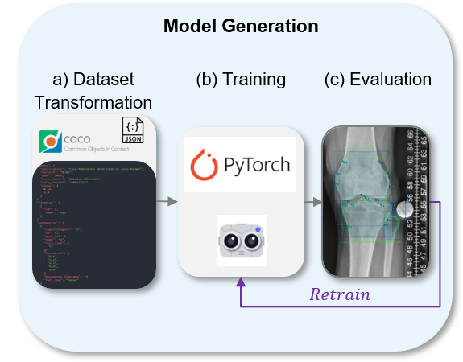

# FastSegEvaluator
> A deep learning pipeline for dataset preparation, training, and validation of medical datasets obtained from the [FastSeg application](https://github.com/NikonPic/FastSeg) and based on [detectron2](https://github.com/facebookresearch/detectron2).

<p align="center">
  
</p>

## Setup
1. Install Python (Recommended 3.6+)
2. Install the requirements.txt file

```bash
pip install -r requirements.txt
```

## What does each file do? 

    .     
    ├── src                              # Source Code
    │   ├── get_labels.py                # transform raw data to dataset
    │   ├── prep_dataset.py              # copy required files
    │   ├── utils.py                     # general utils
    │   ├── utils_detectron.py           # utils for training
    │   └── train_detectron.ipynb        # train + eval
    |
    ├── data                             # Folder with raw data
    │   ├── your images                  # subfolder with images
    │   └── your dataset                 # subfolder with labels
    |
    └── results                          # Contains the final results

## Links to related repositories:
[FastSeg](https://github.com/NikonPic/FastSeg)
[detectron2](https://github.com/facebookresearch/detectron2)